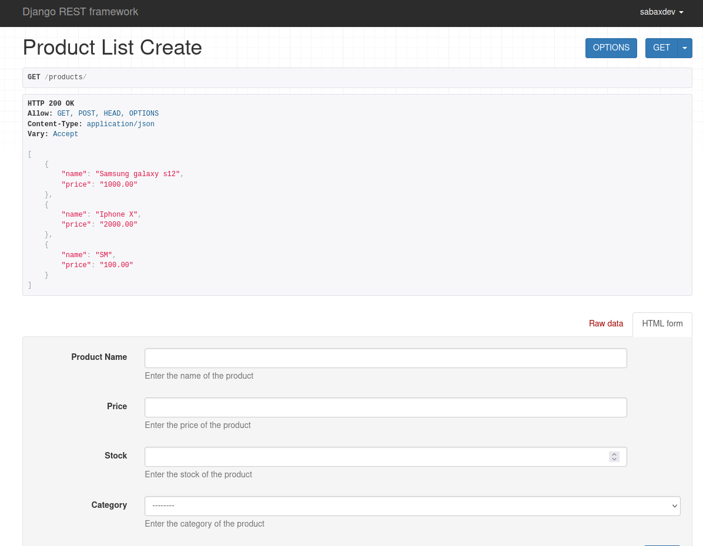
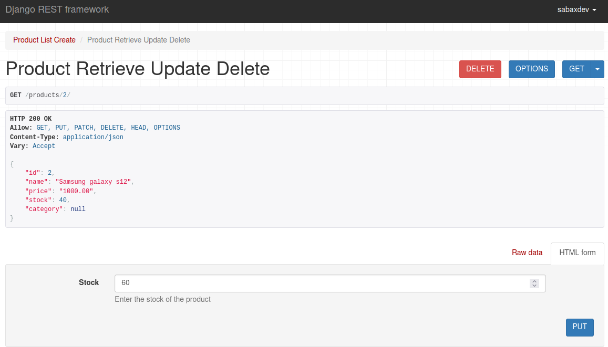

# Django RESTful API Project

This Django project implements a RESTful API for managing products and categories.

## Project Structure

The project consists of the following components:

- `rest_app`: Django app containing models, views, serializers, and other logic related to the REST API.

## Installation

1. Clone the repository:

   ```bash
   git clone <repository-url>

    Install dependencies:


pip install -r requirements.txt

Apply migrations:


python manage.py migrate

Run the development server:


    python manage.py runserver

Features

    Products: CRUD operations for managing products.
    Categories: Basic management of product categories.

Endpoints
Product Endpoints

    GET /products/: Retrieve a list of all products.
    POST /products/: Create a new product.
    GET /products/{product_id}/: Retrieve details of a specific product.
    PUT /products/{product_id}/: Update details of a specific product.
    DELETE /products/{product_id}/: Delete a specific product.

Category Endpoints

    GET /categories/: Retrieve a list of all categories.
    POST /categories/: Create a new category.
    GET /categories/{category_id}/: Retrieve details of a specific category.
    PUT /categories/{category_id}/: Update details of a specific category.
    DELETE /categories/{category_id}/: Delete a specific category.

Authentication and Authorization

    Basic Authentication is used for POST requests to the product endpoints.
    Authorization is required for all POST requests to ensure only authenticated users can add products.

Models
Product Model

    name: CharField - Name of the product.
    price: DecimalField - Price of the product.
    stock: IntegerField - Available stock of the product.
    category: ForeignKey - Category of the product.

Category Model

    name: CharField - Name of the category.

Serializers

    ProductSerializer: Serializer for POST and DELETE methods of Product.
    ProductListSerializer: Serializer for GET method of Product.
    ProductUpdateSerializer: Serializer for PUT method of Product.

## Screenshots

List of all products

Specific product


This README covers basic information about your Django project, including its structure, installation instructions, features, endpoints, authentication, models, and serializers. Feel free to customize it further to better suit your project's needs!


